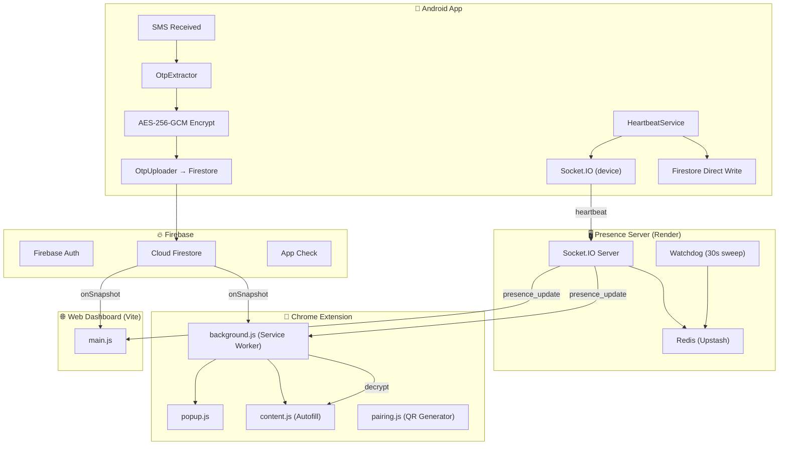
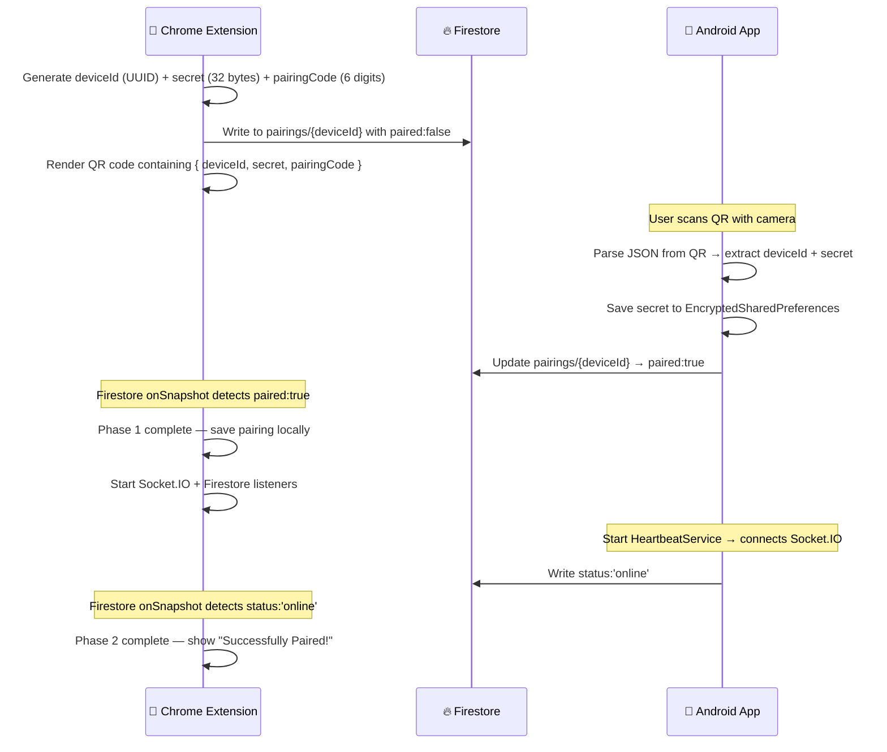
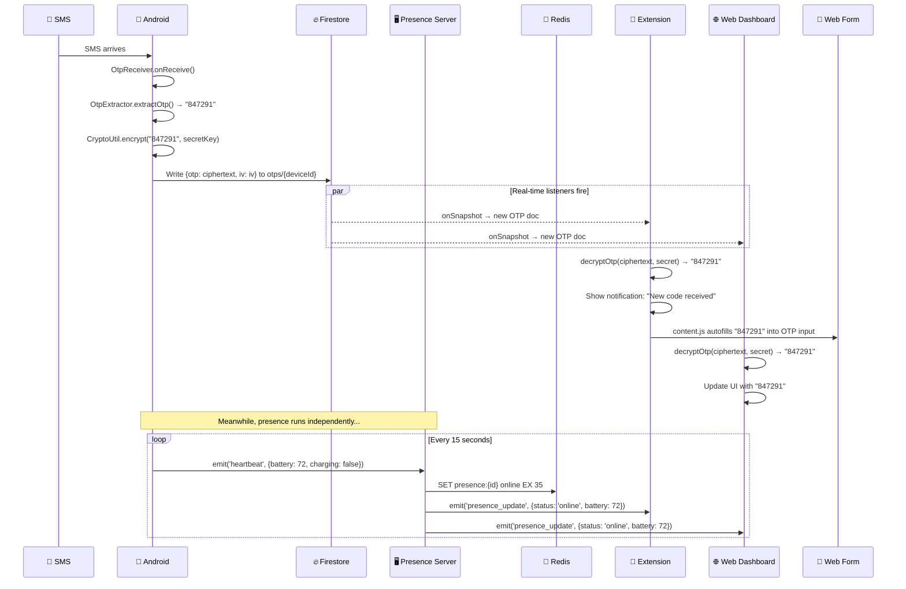

# PinBridge — Complete Technical Guide

**PinBridge** is an end-to-end encrypted OTP mirroring system that securely relays SMS verification codes from an Android phone to a Chrome browser in real-time.

This document covers **every feature and technology** used in the project, with full explanations.

---

## Architecture Overview



---

## Project Structure

| Directory | Purpose | Tech Stack |
|:---|:---|:---|
| [android/](file:///Users/muhammednaseel/Desktop/Project/PinBridge/android) | Android app — SMS capture, encryption, heartbeat | Kotlin, Jetpack Compose, Hilt, CameraX, ML Kit, Firebase, Socket.IO |
| [extension/](file:///Users/muhammednaseel/Desktop/Project/PinBridge/extension) | Chrome Extension — pairing, OTP display, autofill | JavaScript, Webpack, Manifest V3, Firebase JS SDK, Socket.IO Client |
| [server/](file:///Users/muhammednaseel/Desktop/Project/PinBridge/server) | Presence Server — real-time status relay | Node.js, Express, Socket.IO, Redis, Firebase Admin SDK |
| [web/](file:///Users/muhammednaseel/Desktop/Project/PinBridge/web) | Web Dashboard — full OTP dashboard in browser | Vite, Vanilla JS, Firebase JS SDK, Socket.IO Client |
| [functions/](file:///Users/muhammednaseel/Desktop/Project/PinBridge/functions) | Firebase Cloud Functions | TypeScript, Firebase Functions SDK |

---

# Feature 1: Firebase Authentication

**Purpose:** Identity management across all components.

### How it works

| Component | Auth Method | Why |
|:---|:---|:---|
| Android App | Anonymous Auth + Google Sign-In | Gets a UID to tag Firestore writes. Anonymous is used when no Google account is needed. |
| Chrome Extension | Google Sign-In via `chrome.identity.launchWebAuthFlow` | Links the browser to the user's Google account for Cloud Sync. |
| Web Dashboard | Google Sign-In via `signInWithPopup` | Same Google account lets the web auto-discover the pairing. |
| Presence Server | Firebase Admin SDK `verifyIdToken()` | Validates every Socket.IO connection by checking the token sent in the handshake. |

### Key Files

- **Android:** [AppModule.kt](file:///Users/muhammednaseel/Desktop/Project/PinBridge/android/app/src/main/java/com/pinbridge/otpmirror/di/AppModule.kt) — provides `FirebaseAuth` singleton via Hilt.
- **Extension:** [background.js](file:///Users/muhammednaseel/Desktop/Project/PinBridge/extension/src/background.js#L39-L49) — `waitForAuth()` helper waits for session to restore from IndexedDB on MV3 cold-start.
- **Server:** [index.js](file:///Users/muhammednaseel/Desktop/Project/PinBridge/server/index.js#L72-L91) — middleware that verifies tokens before allowing Socket.IO connections.
- **Web:** [main.js](file:///Users/muhammednaseel/Desktop/Project/PinBridge/web/main.js#L879-L939) — `onAuthStateChanged` listener + auto-pairing from cloud sync.

---

# Feature 2: Cloud Firestore

**Purpose:** Persistent database for pairings, encrypted OTPs, and user sync data.

### Collections

#### `pairings/{deviceId}`
The "handshake" document between phone and browser.

| Field | Type | Description |
|:---|:---|:---|
| `googleUid` | string | Owner's Google UID |
| `secret` | string | Base64-encoded AES-256 key |
| `pairingCode` | string | 6-digit code for manual entry |
| `paired` | boolean | `true` after Android confirms |
| `status` | string | `'online'` or `'offline'` |
| `lastOnline` | timestamp | Server timestamp of last activity |
| `batteryLevel` | number | Phone battery percentage |
| `isCharging` | boolean | Charging status |
| `fetchRequested` | timestamp | Set by extension to request manual OTP fetch |

#### `otps/{deviceId}`
The encrypted OTP "inbox."

| Field | Type | Description |
|:---|:---|:---|
| `otp` | string | AES-256-GCM **ciphertext** (not plaintext!) |
| `iv` | string | Base64-encoded initialization vector |
| `sender` | string | SMS sender address |
| `otpEventId` | string | UUID for deduplication |
| `ts` | timestamp | Server timestamp |
| `smsTs` | number | Original SMS timestamp (ms) |
| `uploaderUid` | string | Firebase UID of the uploader |
| `expiresAt` | timestamp | Auto-delete after 10 minutes |

#### `users/{googleUid}/mirroring/active`
Cloud Sync — enables "login and it works" on any browser.

| Field | Type | Description |
|:---|:---|:---|
| `deviceId` | string | Paired phone's device ID |
| `secret` | string | Pairing secret for auto-sync |
| `pairedAt` | timestamp | When pairing was established |

### Security Rules
File: [firestore.rules](file:///Users/muhammednaseel/Desktop/Project/PinBridge/firestore.rules)

- **Pairings:** Only the owner (matched by `googleUid`) can read/update/delete. Heartbeat-only updates bypass the ownership check.
- **OTPs:** Only the uploader or the pairing owner can read. Write requires authentication. This prevents other users from reading your codes.
- **Users:** Strict `request.auth.uid == userId` — you can only access your own data.

---

# Feature 3: Socket.IO (Real-Time Presence)

**Purpose:** Sub-second delivery of online/offline status and battery data.

### Server Setup
File: [server/index.js](file:///Users/muhammednaseel/Desktop/Project/PinBridge/server/index.js)

- **CORS:** Whitelisted origins only + `chrome-extension://` protocol.
- **Ping:** `pingInterval: 5s`, `pingTimeout: 15s` — detects dead connections quickly.
- **Rooms:** Each device gets a room `room:{deviceId}`. All viewers join the same room, so broadcasts reach everyone.

### Client Types

| Type | Who | Role |
|:---|:---|:---|
| `device` | Android App | **Producer** — sends heartbeats, creates the online presence |
| `viewer` | Extension / Web | **Consumer** — receives presence updates, never sends heartbeats |

### Events

| Event | Direction | Payload |
|:---|:---|:---|
| `heartbeat` | Device → Server | `{ batteryLevel, isCharging }` |
| `presence_update` | Server → Viewers | `{ deviceId, status, lastSeen, batteryLevel, isCharging }` |
| `request_presence` | Viewer → Server | _(none)_ — asks server for current cached status |

### Watchdog
Every 30 seconds, the server sweeps `lastHeartbeatMap`. If any device hasn't sent a heartbeat in 40s, it's marked offline — catching cases where the app was force-killed or the network dropped silently.

---

# Feature 4: Redis (In-Memory Cache)

**Purpose:** Fast presence lookups without hitting Firestore on every heartbeat.

### Keys

| Key Pattern | Value | TTL | Purpose |
|:---|:---|:---|:---|
| `presence:{deviceId}` | `'online'` / `'offline'` | 35s | Auto-expires if no heartbeat refreshes it |
| `lastSeen:{deviceId}` | Timestamp (ms) | None | When the device was last active |
| `battery:{deviceId}` | JSON `{level, isCharging}` | None | Latest battery info |

### Why Redis + Firestore?
- **Redis** is the **fast path** — every heartbeat refreshes the 35s TTL. Viewers get instant status.
- **Firestore** is the **durable path** — synced every 60s (throttled). Survives server restarts and acts as a fallback when the Socket.IO server is cold-starting.

---

# Feature 5: AES-256-GCM Encryption (End-to-End)

**Purpose:** Ensures that nobody — not Firebase, not the server, not even Google — can read your OTPs.

### How it works

1. **Key Generation** (during pairing): The Chrome Extension generates a cryptographically random 32-byte key using `crypto.getRandomValues()`. This key is shared with the Android app via the QR code.

2. **Encryption** (Android): When an SMS arrives, the OTP is encrypted using AES-256-GCM before being written to Firestore.
   - File: [CryptoUtil.kt](file:///Users/muhammednaseel/Desktop/Project/PinBridge/android/app/src/main/java/com/pinbridge/otpmirror/CryptoUtil.kt)
   - Algorithm: `AES/GCM/NoPadding`
   - IV: 12 bytes, randomly generated per encryption
   - Tag: 128-bit authentication tag

3. **Decryption** (Browser): The extension/web dashboard decrypts using the same key.
   - Extension: [crypto.js](file:///Users/muhammednaseel/Desktop/Project/PinBridge/extension/src/crypto.js) — uses Web Crypto API `crypto.subtle.decrypt()`
   - Web: Inline in [main.js](file:///Users/muhammednaseel/Desktop/Project/PinBridge/web/main.js#L112-L120) — identical logic

### Security Properties
- **Confidentiality:** AES-256 — military-grade encryption.
- **Integrity:** GCM mode includes an authentication tag that detects tampering.
- **Forward Secrecy:** Each OTP uses a unique random IV, so even if one message is compromised, others remain safe.

> [!IMPORTANT]
> The secret key **never** leaves the device and browser. It is passed via QR code (local camera scan) and stored in `EncryptedSharedPreferences` on Android and `chrome.storage.local` in the extension. It is **never** written to Firestore or any server.

---

# Feature 6: QR Code Pairing

**Purpose:** Securely establishes the link between phone and browser without typing anything.

### Flow



### Key Files
- **QR Generation:** [pairing.js](file:///Users/muhammednaseel/Desktop/Project/PinBridge/extension/src/pairing.js) — uses `qrcode` npm library
- **QR Scanning:** [PairingScannerActivity.kt](file:///Users/muhammednaseel/Desktop/Project/PinBridge/android/app/src/main/java/com/pinbridge/otpmirror/PairingScannerActivity.kt) — uses CameraX + ML Kit Barcode
- **Manual Entry:** [ManualCodeEntryActivity.kt](file:///Users/muhammednaseel/Desktop/Project/PinBridge/android/app/src/main/java/com/pinbridge/otpmirror/ManualCodeEntryActivity.kt) — fallback 6-digit code entry

---

# Feature 7: Chrome Extension (Manifest V3)

**Purpose:** The primary browser-side client — receives OTPs, shows notifications, autofills forms.

### Source Files

| File | Purpose |
|:---|:---|
| [background.js](file:///Users/muhammednaseel/Desktop/Project/PinBridge/extension/src/background.js) | Service Worker — Socket.IO client, Firestore listeners, state management |
| [popup.js](file:///Users/muhammednaseel/Desktop/Project/PinBridge/extension/src/popup.js) | Side Panel / Popup UI — shows OTP, connection status, battery |
| [pairing.js](file:///Users/muhammednaseel/Desktop/Project/PinBridge/extension/src/pairing.js) | Pairing page — QR code generator, Firestore listener for confirmation |
| [content.js](file:///Users/muhammednaseel/Desktop/Project/PinBridge/extension/src/content.js) | Content script — autofills OTP into web forms, syncs with web dashboard |
| [crypto.js](file:///Users/muhammednaseel/Desktop/Project/PinBridge/extension/src/crypto.js) | AES-256-GCM decryption using Web Crypto API |
| [config.js](file:///Users/muhammednaseel/Desktop/Project/PinBridge/extension/src/config.js) | Shared config — Firebase config, server URL, Google Client ID |

### MV3-Specific Challenges & Solutions

| Challenge | Solution |
|:---|:---|
| Service Worker sleeps after ~30s | Chrome Alarm keepalive every 24s |
| No XMLHttpRequest (breaks Socket.IO polling) | Force `transports: ['websocket']` |
| Auth state lost on cold start | `waitForAuth()` helper waits for IndexedDB restore |
| Popup can't hold persistent connections | Polls background via `refreshStatus` every 3s |

### State Manager
A centralized `stateManager` object in background.js is the single source of truth. It accepts updates from both Socket.IO and Firestore, deduplicates them, and pushes to the popup/sidepanel via `chrome.runtime.sendMessage`.

---

# Feature 8: Android Foreground Service

**Purpose:** Keeps the heartbeat running even when the app is in the background or killed.

### File: [DeviceHeartbeatService.kt](file:///Users/muhammednaseel/Desktop/Project/PinBridge/android/app/src/main/java/com/pinbridge/otpmirror/DeviceHeartbeatService.kt)

### What it does
1. Starts as a foreground service with a silent, dismissible notification
2. Connects to the Socket.IO presence server as `clientType: "device"`
3. Sends `heartbeat` events every **15 seconds** with battery level
4. Writes directly to Firestore every **15 seconds** (independent fallback)
5. Monitors network changes — disconnects on loss, reconnects on restore
6. Refreshes Firebase token every **45 minutes**
7. Survives app-kill via `START_STICKY` + `AlarmManager` restart

### Reconnection Strategy
```
Attempt 0 → 3 seconds
Attempt 1 → 5 seconds
Attempt 2 → 10 seconds
Attempt 3 → 30 seconds
Attempt 4+ → 60 seconds (max)
```

### Boot Recovery
File: [BootReceiver.kt](file:///Users/muhammednaseel/Desktop/Project/PinBridge/android/app/src/main/java/com/pinbridge/otpmirror/BootReceiver.kt)
- Listens for `ACTION_BOOT_COMPLETED`
- Checks if device is paired using `EncryptedSharedPreferences`
- If paired, restarts `DeviceHeartbeatService` automatically

---

# Feature 9: SMS Reception & OTP Extraction

**Purpose:** Intercepts incoming SMS, extracts the OTP code, and uploads it.

### SMS Reception
File: [OtpReceiver.kt](file:///Users/muhammednaseel/Desktop/Project/PinBridge/android/app/src/main/java/com/pinbridge/otpmirror/OtpReceiver.kt)
- `BroadcastReceiver` for `SMS_RECEIVED_ACTION`
- Uses `goAsync()` for extended processing time
- Tries `directUpload()` first (8s timeout), falls back to `WorkManager`

### OTP Extraction
File: [OtpExtractor.kt](file:///Users/muhammednaseel/Desktop/Project/PinBridge/android/app/src/main/java/com/pinbridge/otpmirror/OtpExtractor.kt)

Uses a keyword-scored extraction strategy:
1. Scores the message based on keyword presence (`otp`, `code`, `verification`, `verify`, `pin`, `token`, `password`)
2. Extracts 4-8 digit candidates using regex `\b\d{4,8}\b`
3. Excludes false positives (currency amounts like `₹5000`, phone numbers)
4. Prefers 6-digit codes (most common OTP length)

### Manual Fetch
File: [SmsRetriever.kt](file:///Users/muhammednaseel/Desktop/Project/PinBridge/android/app/src/main/java/com/pinbridge/otpmirror/SmsRetriever.kt)
- Queries the SMS inbox (`content://sms/inbox`) for the latest 20 messages
- Uses the same `OtpExtractor` logic for consistency
- Triggered remotely when the extension sets `fetchRequested` on the pairing doc

---

# Feature 10: WorkManager (Reliable Upload)

**Purpose:** Guarantees OTP delivery even with poor connectivity.

### Files
- [OtpUploader.kt](file:///Users/muhammednaseel/Desktop/Project/PinBridge/android/app/src/main/java/com/pinbridge/otpmirror/OtpUploader.kt) — enqueues the work
- [UploadOtpWorker.kt](file:///Users/muhammednaseel/Desktop/Project/PinBridge/android/app/src/main/java/com/pinbridge/otpmirror/UploadOtpWorker.kt) — the actual worker

### How it works
1. `OtpReceiver` first tries a `directUpload()` (immediate Firestore write)
2. If that fails (timeout, no network), it falls back to `WorkManager.enqueue()`
3. WorkManager uses **exponential backoff** (starting at 30s) and will retry until successful
4. The worker encrypts the OTP, signs in anonymously if needed, and writes to Firestore

---

# Feature 11: Hilt Dependency Injection

**Purpose:** Clean dependency management across the Android app.

### File: [AppModule.kt](file:///Users/muhammednaseel/Desktop/Project/PinBridge/android/app/src/main/java/com/pinbridge/otpmirror/di/AppModule.kt)

### Provided Singletons
| Dependency | What it provides |
|:---|:---|
| `FirebaseAuth` | Authentication instance |
| `FirebaseFirestore` | Database instance |
| `SharedPreferences` | **Encrypted** SharedPreferences using `MasterKey.AES256_GCM` |
| `PairingRepository` | Business logic for pairing operations |

### Security
SharedPreferences are encrypted using Android's `EncryptedSharedPreferences`:
- **Key encryption:** AES256-SIV
- **Value encryption:** AES256-GCM
- This means the pairing secret stored on-device is encrypted at rest.

---

# Feature 12: OTP Autofill (Content Script)

**Purpose:** Automatically fills OTP codes into web forms without any user action.

### File: [content.js](file:///Users/muhammednaseel/Desktop/Project/PinBridge/extension/src/content.js#L90-L118)

### How it works
1. When a new OTP arrives, `background.js` sends it to all open tabs
2. The content script searches for visible, enabled input fields matching OTP selectors:
   - `input[autocomplete="one-time-code"]`
   - `input[name*="code"]`, `input[name*="otp"]`, `input[name*="pin"]`
   - `input[type="number"]`, `input[type="tel"]`
3. Sets the value and dispatches `input` + `change` events (for React/Vue compatibility)
4. The content script also handles **Extension ↔ Web Dashboard sync**, passing pairing data via `window.postMessage`

---

# Feature 13: Web Dashboard (Vite)

**Purpose:** Full-featured OTP dashboard accessible from any browser.

### Files
- [main.js](file:///Users/muhammednaseel/Desktop/Project/PinBridge/web/main.js) — 940-line single-file app
- [style.css](file:///Users/muhammednaseel/Desktop/Project/PinBridge/web/style.css) — Premium dark theme
- [vite.config.js](file:///Users/muhammednaseel/Desktop/Project/PinBridge/web/vite.config.js) — Build config

### Three Screens
1. **Sign-In** — Google Sign-In with popup
2. **Unpaired** — Waiting for the extension to pair, shows instructions
3. **Paired** — Full dashboard with OTP display, connection indicator, battery, copy/fetch buttons

### Cloud Sync Magic
When you sign into the web dashboard:
1. `onAuthStateChanged` fires with your Google user
2. It reads `users/{uid}/mirroring/active` from Firestore
3. If a valid pairing exists, it auto-loads the `deviceId` and `secret` into memory
4. Starts Socket.IO + Firestore listeners immediately
5. **Result:** Login → Dashboard with live data in ~2 seconds

---

# Feature 14: Helmet.js & Express Security

**Purpose:** HTTP security headers for the presence server.

File: [server/index.js](file:///Users/muhammednaseel/Desktop/Project/PinBridge/server/index.js#L349)

Helmet automatically sets headers like:
- `X-Content-Type-Options: nosniff`
- `X-Frame-Options: DENY`
- `Strict-Transport-Security` (HSTS)
- `Content-Security-Policy`

---

# Feature 15: Firebase App Check

**Purpose:** Protects Firebase APIs from abuse by verifying that requests come from your legitimate app.

File: [web/main.js](file:///Users/muhammednaseel/Desktop/Project/PinBridge/web/main.js#L42-L45)

Uses `ReCaptchaV3Provider` to silently verify that the user is on the real PinBridge website, not a spoofed clone.

---

# Complete End-to-End Flow

Here is exactly what happens when you receive an SMS OTP:



---

# Timing Constants Reference

| Constant | Value | Component | Purpose |
|:---|:---|:---|:---|
| Heartbeat interval | 15s | Android | How often the phone says "I'm alive" |
| Redis TTL | 35s | Server | Auto-expire presence if no heartbeat |
| Watchdog timeout | 40s | Server | Mark device offline after this silence |
| Watchdog sweep | 30s | Server | How often the server checks for dead devices |
| Firestore sync throttle | 60s | Server | Max frequency of Firestore presence writes |
| Online threshold | 25s | Extension/Web | UI considers device "online" if heard from within this |
| Socket ping interval | 5s | Server | Socket.IO's internal keepalive |
| Socket ping timeout | 15s | Server | Socket.IO marks connection dead after this |
| Extension keepalive alarm | 24s | Extension | Prevents MV3 service worker from sleeping |
| Listener restart cooldown | 15s | Extension | Prevents reconnection loops |
| Token refresh | 45min | Android | Refreshes Firebase auth token before expiry |
| Reconnect backoff | 3s→60s | Android | Exponential backoff for socket reconnection |
| OTP expiry | 10min | Android/Server | Auto-delete OTPs from Firestore |
| Pairing session timeout | 10min | Extension | QR code expires after this |
| Manual fetch timeout | 30s | Extension | How long to wait for device to respond |

---

# Infrastructure & Hosting

| Component | Host | Plan |
|:---|:---|:---|
| Presence Server | **Render** | Free tier (cold starts after 15min idle) |
| Redis | **Upstash** | Free tier (TLS enabled) |
| Web Dashboard | **Firebase Hosting** + **Vercel** | Free tier |
| Database | **Cloud Firestore** | Spark (free) plan |
| Auth | **Firebase Auth** | Free tier |
| Android App | **Local / Play Store** | N/A |
| Extension | **Chrome Web Store** | N/A |
