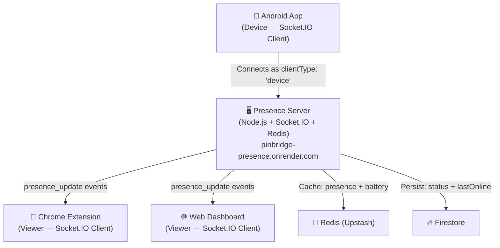

# How Socket.IO Works in PinBridge

Socket.IO in PinBridge serves a single purpose: **real-time device presence tracking** (online/offline status + battery info). It does **not** handle OTP data — that flows entirely through Firestore.

---

## Architecture Overview



---

## The 4 Components

### 1. Server — [index.js](file:///Users/muhammednaseel/Desktop/Project/PinBridge/server/index.js)

The central hub. Node.js + Express + Socket.IO v4.8.3, hosted on Render.

**Key configuration:**
```js
const io = new Server(server, {
    cors: { origin: ALLOWED_ORIGINS + chrome-extension:// },
    pingTimeout: 15000,
    pingInterval: 5000
});
```

**What it does:**
- Authenticates every connection via Firebase ID token verification (middleware)
- Groups connections into **rooms** by `deviceId` — so a device and its viewers share a room
- Stores presence in **Redis** (fast) with a 35-second TTL
- Periodically syncs to **Firestore** (durable, fallback for when socket is down)
- Runs a **watchdog** every 30s to catch dirty disconnects (app killed, network drop)

---

### 2. Android App — [DeviceHeartbeatService.kt](file:///Users/muhammednaseel/Desktop/Project/PinBridge/android/app/src/main/java/com/pinbridge/otpmirror/DeviceHeartbeatService.kt)

The only **producer** of presence data. Connects as `clientType: "device"`.

**What it does:**
- Runs as a foreground service (survives app-kill via `START_STICKY` + `AlarmManager` restart)
- Connects to the server with a Firebase token + deviceId
- Sends a `heartbeat` event every **15 seconds** with battery level and charging status
- Has exponential backoff reconnection (3s → 5s → 10s → 30s → 60s max)
- Monitors network changes — disconnects on network loss, reconnects on network available
- Refreshes Firebase token every 45 minutes to prevent auth expiry

---

### 3. Chrome Extension — [background.js](file:///Users/muhammednaseel/Desktop/Project/PinBridge/extension/src/background.js)

A **consumer/viewer** of presence data. Connects as `clientType: "viewer"`.

**What it does:**
- Connects with `transports: ['websocket']` only (MV3 service workers don't support XHR/long-polling)
- On connect, emits `request_presence` to get the current cached status from Redis
- Listens for `presence_update` events and feeds them into a centralized `stateManager`
- Has a 15-second cooldown to prevent restart loops from the popup's 3s polling
- Uses a Chrome alarm keepalive (every ~24s) to prevent the service worker from sleeping

---

### 4. Web Dashboard — [main.js](file:///Users/muhammednaseel/Desktop/Project/PinBridge/web/main.js)

Another **consumer/viewer**. Same `clientType: "viewer"` role.

**What it does:**
- Creates a socket with the default transports (websocket + long-polling fallback)
- On connect, emits `request_presence` for immediate status
- Updates UI connection indicator, battery display, and sidebar in real-time
- Has a "Sync Signal" button that manually disconnects/reconnects the socket

---

## Connection Lifecycle

### Step 1: Authentication (Middleware)

Every Socket.IO connection goes through [this middleware](file:///Users/muhammednaseel/Desktop/Project/PinBridge/server/index.js#L72-L91):

```
Client connects → sends { token, deviceId, clientType } in handshake auth
                → Server verifies Firebase ID token
                → Attaches user, deviceId, clientType to socket
                → Joins room: `room:{deviceId}`
```

If auth fails → connection is rejected with an error.

### Step 2: Initial State Exchange

On connection, depending on client type:

| Client Type | Server Action |
|---|---|
| **device** | Sets Redis `presence:{deviceId}` = `'online'` (35s TTL), writes to Firestore, broadcasts `presence_update` to all room members |
| **viewer** | Reads current status from Redis, sends `presence_update` back to just this socket |

### Step 3: Heartbeat Loop

```
Android (every 15s) → emit('heartbeat', { batteryLevel, isCharging })
                    → Server updates Redis TTL (refreshes 35s expiry)
                    → Server broadcasts presence_update to room
                    → Throttled Firestore sync (max once per 60s, except first heartbeat)
```

### Step 4: Disconnect Handling

**Clean disconnect** (user closes app, signs out):
```
Socket disconnects → Server sets Redis to 'offline'
                   → Writes offline status to Firestore
                   → Broadcasts presence_update with status: 'offline' to room
```

**Dirty disconnect** (app killed, network drops):
```
No heartbeat for 40s → Watchdog sweep (runs every 30s) detects timeout
                     → Same cleanup as clean disconnect
```

> [!NOTE]
> The Redis TTL (35s) provides a second safety net. Even if the watchdog misses it, Redis will automatically expire the key and the next viewer `request_presence` will get `'offline'`.

---

## Room-Based Broadcasting

The server uses Socket.IO rooms to efficiently route updates:

```js
socket.join(`room:${deviceId}`);                    // On connect
io.to(`room:${deviceId}`).emit('presence_update', data); // Broadcast to all
socket.emit('presence_update', data);               // To single viewer
```

This means:
- When the Android device sends a heartbeat, **all** viewers (extension + web dashboard) in that device's room get the update instantly
- A viewer only receives updates for **its own** paired device

---

## Data Flow Summary

```
┌─────────────────────────────────────────────────────────────┐
│                    PRESENCE DATA FLOW                        │
│                                                             │
│  Android App                                                │
│    ├─ emit('heartbeat', {battery, charging})  ──► Server    │
│    │                                              │         │
│    │                                     ┌────────┼────┐    │
│    │                                     ▼        ▼    ▼    │
│    │                                   Redis   Firestore    │
│    │                                   (35s     (60s        │
│    │                                    TTL)    throttle)   │
│    │                                     │                  │
│    │                              broadcast to room         │
│    │                                     │                  │
│    │                              ┌──────┴──────┐           │
│    │                              ▼             ▼           │
│    │                          Extension    Web Dashboard    │
│    │                          (viewer)     (viewer)         │
│    │                                                        │
│  Also: Direct Firestore heartbeat every 15s (fallback)      │
│  (Ensures status is visible even when socket server is down)│
└─────────────────────────────────────────────────────────────┘
```

---

## Key Events Reference

| Event | Direction | Payload | Purpose |
|-------|-----------|---------|---------|
| `heartbeat` | Device → Server | `{ batteryLevel, isCharging }` | Keep presence alive, send battery data |
| `presence_update` | Server → Viewers | `{ deviceId, status, lastSeen, batteryLevel, isCharging }` | Broadcast current device status |
| `request_presence` | Viewer → Server | _(none)_ | Ask server for current cached status (on connect/reconnect) |

---

## Important Timing Constants

| Parameter | Value | Where |
|-----------|-------|-------|
| Heartbeat interval | 15 seconds | Android `DeviceHeartbeatService` |
| Redis TTL | 35 seconds | Server `redis.set(..., 'EX', 35)` |
| Watchdog timeout | 40 seconds | Server `TIMEOUT_MS` |
| Watchdog sweep interval | 30 seconds | Server `setInterval` |
| Firestore sync throttle | 60 seconds | Server `FIRESTORE_SYNC_INTERVAL` |
| Online threshold (UI) | 25 seconds | Extension + Web `ONLINE_THRESHOLD` |
| Socket ping interval | 5 seconds | Server Socket.IO config |
| Socket ping timeout | 15 seconds | Server Socket.IO config |
| Extension keepalive alarm | ~24 seconds | Chrome alarm `periodInMinutes: 0.4` |
| Listener restart cooldown | 15 seconds | Extension `LISTENERS_COOLDOWN_MS` |
| Token refresh | 45 minutes | Android `TOKEN_REFRESH_INTERVAL` |
| Reconnect backoff | 3s → 5s → 10s → 30s → 60s | Android `getReconnectDelay()` |

---

## Dual-Path Redundancy

PinBridge uses **two parallel paths** for presence:

1. **Primary: Socket.IO → Redis → broadcast** (real-time, sub-second latency)
2. **Fallback: Android → Firestore direct write** (every 15s, independent of socket)

The Android app writes directly to Firestore via [startFirestoreHeartbeat()](file:///Users/muhammednaseel/Desktop/Project/PinBridge/android/app/src/main/java/com/pinbridge/otpmirror/DeviceHeartbeatService.kt#L281-L308) regardless of socket state. This ensures the extension's Firestore `onSnapshot` listener can still detect the device as online even if the socket server (Render free tier) is cold-starting or down.
