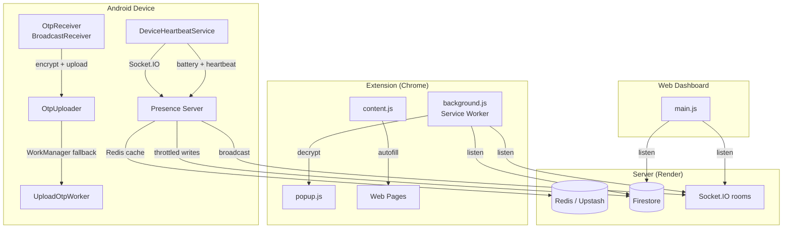

# PinBridge — Production-Readiness Technical Audit

> **Scope**: Android app, Chrome Extension, Web Dashboard, Presence Server
> **Codebase**: ~5,330 lines across 22 source files
> **Date**: April 2026

---

## 1. Problem Definition

PinBridge is a cross-platform OTP mirroring system that works but suffers from intermittent instability and recurring bugs despite multiple fix rounds. This audit identifies the structural root causes behind that instability and provides a prioritized remediation roadmap to bring the system to production-grade quality.

---

## 2. Assumptions / Unknowns

| Item | Status |
|------|--------|
| Firestore is on Spark (free) plan | **Assumed** — no Cloud Functions deployment suggests Spark |
| Redis is Upstash (serverless) | Confirmed via `ioredis` + TLS config |
| Server deploys to Render (free tier) | Confirmed via URL `pinbridge-presence.onrender.com` |
| No automated test suite exists | **Confirmed** — zero test files found; extension `npm test` likely fails |
| No staging environment | **Assumed** — single branch, no env-based config switching |
| Firebase Admin SDK key is in env vars on Render | **Assumed** |
| ProGuard/R8 rules are configured for release builds | Confirmed via `proguard-rules.pro` |

> [!IMPORTANT]
> **Critical Unknown**: The Render free tier puts the server to sleep after 15 minutes of inactivity. This means the first Socket.IO connection after idle will take 30-60s to cold-start, which directly causes the "device appears offline" bug on first app open.

---

## 3. Technical Breakdown

### 3.1 Architecture Assessment



**Architectural Strengths:**
- End-to-end encryption (AES-256-GCM) is correctly implemented — server never sees plaintext OTPs
- Dual delivery (Socket.IO + Firestore) provides both speed and reliability
- WorkManager fallback ensures OTP delivery even on flaky networks
- EncryptedSharedPreferences for local secret storage

**Architectural Weaknesses:**

#### 🔴 W-1: Firebase Config Duplication
The Firebase config object is hardcoded in **4 separate files**: `background.js`, `pairing.js`, `web/main.js`, and `popup.js`. Any config rotation requires touching all four.

#### 🔴 W-2: Secret Stored in Firestore `pairings/{id}` Document
The AES secret is written to Firestore during pairing ([PairingRepository.kt:139](file:///Users/muhammednaseel/Desktop/Project/PinBridge/android/app/src/main/java/com/pinbridge/otpmirror/data/PairingRepository.kt#L139), [pairing.js:73](file:///Users/muhammednaseel/Desktop/Project/PinBridge/extension/src/pairing.js#L73)). Any authenticated user can read any `pairings/{deviceId}` document per the current Firestore rules. This means **any logged-in user could read another user's encryption key** if they know the deviceId.

#### 🟡 W-3: Monolithic `MainActivity.kt` (966 lines)
The Activity contains all Composable UI, sign-in logic, cloud sync validation, permission handling, and pairing verification. This violates separation of concerns and makes the file difficult to test, maintain, or extend.

#### 🟡 W-4: No ViewModel Layer
All UI state is managed via `remember {}` composables and `PairingRepository.pairingStatus` flow — no ViewModels. This means state is lost on configuration changes (though Compose mitigates some of this) and business logic is not testable in isolation.

#### 🟡 W-5: Dual Firestore Listeners on Same Document
In [background.js:406-437](file:///Users/muhammednaseel/Desktop/Project/PinBridge/extension/src/background.js#L406-L437), two separate `onSnapshot` listeners are registered on `pairings/{deviceId}` — one for status and one for pairing state. This doubles Firestore reads and creates potential race conditions where one listener triggers `performUnpairOnly()` while the other is still processing.

---

### 3.2 Security Review

| Finding | Severity | Location |
|---------|----------|----------|
| **SEC-1**: Firestore rules allow any authenticated user to read/write any `pairings/{deviceId}` or `otps/{deviceId}` document | 🔴 Critical | [firestore.rules:4-9](file:///Users/muhammednaseel/Desktop/Project/PinBridge/firestore.rules#L4-L9) |
| **SEC-2**: OAuth `client_secret_*.json` tracked in Git | 🔴 Critical | Root directory |
| **SEC-3**: Firebase Admin SDK service account JSON tracked in Git | 🔴 Critical | `pinbridge-61dd4-firebase-adminsdk-*.json` |
| ~~**SEC-4**: Sentry DSN hardcoded in 4 client-side files~~ | ✅ Resolved | Sentry removed |
| **SEC-5**: Firebase API key hardcoded (acceptable for client SDK, but should be env-managed for server) | 🟢 Low | Multiple files |
| **SEC-6**: OTP notification shows plaintext in notification body | 🟡 Medium | [background.js:454](file:///Users/muhammednaseel/Desktop/Project/PinBridge/extension/src/background.js#L454) |
| **SEC-7**: `content_scripts` matches `<all_urls>` — content script injected into every page | 🟡 Medium | [manifest.json:43](file:///Users/muhammednaseel/Desktop/Project/PinBridge/extension/manifest.json#L43) |
| **SEC-8**: Anonymous auth fallback in OTP upload path | 🟡 Medium | [OtpUploader.kt:39-41](file:///Users/muhammednaseel/Desktop/Project/PinBridge/android/app/src/main/java/com/pinbridge/otpmirror/OtpUploader.kt#L39-L41) |

> [!CAUTION]
> **SEC-1** is the most critical finding. Currently, any Firebase-authenticated user (including anonymous) can read the `secret` field from any `pairings/{deviceId}` document if they know or can guess the UUID. This allows them to decrypt all OTPs for that device. The fix is to add `googleUid` ownership checks to the Firestore rules.

**Recommended Firestore Rules:**
```javascript
match /pairings/{deviceId} {
  allow read, write: if request.auth != null 
    && resource.data.googleUid == request.auth.uid;
  allow create: if request.auth != null;
}
```

---

### 3.3 Recurring Bug Root-Cause Analysis

Based on the fix history across conversations, here's a framework mapping symptoms to root causes:

| Symptom | Root Cause | Structural Fix |
|---------|-----------|----------------|
| "Device shows offline then online" on app open | Render cold-start (30-60s). Socket connects but presence server hasn't started processing yet | Upgrade to paid Render tier, or add client-side "connecting..." state instead of "offline" |
| Extension popup shows stale status after SW restart | Chrome MV3 service worker lifecycle kills JS state. `onInstalled` re-bootstraps but `onAuthStateChanged` fires first without `pairedDeviceId` being loaded yet | Initialize from `chrome.storage.local` in a single atomic read before attaching any listeners |
| Zombie heartbeat after remote unpair | `DeviceHeartbeatService` has no Firestore listener — it only responds to `PairingRepository.clearLocalCredentials()` | Already fixed, but the root cause is that the service and the repository have separate lifecycle scopes. Service should observe `pairingStatus` directly |
| Auto-pairing from stale cloud sync on reinstall | Cloud sync doc in `users/{uid}/mirroring/active` persists after uninstall | Already fixed with cleanup, but no TTL or expiration on the document |
| "Sign-in timed out" in extension popup | `launchWebAuthFlow` can hang if popup is closed before OAuth redirect completes | Already handled with timeout, but the 60s timeout is too long for UX |

---

### 3.4 State Management Review

The most fragile part of the system is **state synchronization across 4 platforms**. Current state sources:

| State | Android | Extension | Web | Server |
|-------|---------|-----------|-----|--------|
| Paired? | `SharedPreferences` | `chrome.storage.local` | `localStorage` + Firestore | Firestore `pairings/{id}` |
| Online? | N/A (producer only) | `chrome.storage.local` | `state.isOnline` (JS var) | Redis + Firestore |
| OTP | N/A (producer only) | `chrome.storage.local` | `state.latestOtp` (JS var + localStorage) | Firestore `otps/{id}` |
| Auth | FirebaseAuth | FirebaseAuth + `chrome.storage.local` | FirebaseAuth | Firebase Admin (verify only) |

**Key Problem**: The extension's `chrome.storage.local` acts as a cache layer between Firestore and the popup UI, but there's no invalidation strategy. When the service worker restarts, it bootstraps from storage (which may be stale) and then overwrites it from Firestore listeners (which may fire late). This creates a brief window of inconsistent state — the root cause of several "flicker" bugs.

**Recommendation**: Treat `chrome.storage.local` as the **sole source of truth** for the popup and content scripts. The service worker should be the only writer, updating storage atomically. The popup should never read from Firestore directly.

---

### 3.5 Performance Review

| Area | Finding | Severity |
|------|---------|----------|
| **PERF-1**: Extension webpack bundle is 446 KiB (background.js) — mostly Firebase SDK | 🟡 | Consider tree-shaking or using Firebase REST API |
| **PERF-2**: Content script loaded on ALL pages (`<all_urls>`) | 🟡 | Should only load on sites where OTP autofill is relevant, or at minimum, gate execution behind a quick check |
| **PERF-3**: `SmsRetriever` queries last 20 SMS on every manual fetch | 🟢 | Acceptable for manual action, but cursor query is expensive if done frequently |
| **PERF-4**: Web dashboard does full DOM re-render via `innerHTML` on every state change | 🟡 | `renderPaired()` rebuilds entire DOM tree. Should diff-update only changed elements (already partially done with `updateConnectionIndicator()`) |
| **PERF-5**: WakeLock held for 10 minutes, re-acquired every 15 seconds | 🟡 | Battery drain concern. Should acquire only during heartbeat emission, not hold continuously |
| **PERF-6**: Duplicate socket room join — viewer connects to socket AND listens on Firestore for same status data | 🟢 | Intentional redundancy, but doubles read cost |

---

### 3.6 Reliability & Error-Handling Review

| Area | Finding | Severity |
|------|---------|----------|
| **REL-1**: No retry logic for Firestore writes in server `heartbeat` handler | 🟡 | A single failed write silently drops the update |
| **REL-2**: `OtpReceiver.onReceive()` launches a coroutine but `goAsync()` has a 10s limit — timeout is set to 8s which is tight | 🟡 | If Firestore is slow, the upload may be cut off |
| **REL-3**: Socket.IO auth token may expire mid-session | 🟡 | Token is fetched once at connection time. Long-running sessions (hours) may use an expired token for reconnections |
| **REL-4**: No health-check or keepalive for the Redis connection | 🟢 | ioredis handles reconnection, but no application-level validation |
| **REL-5**: `PairingRepository.startStatusListener()` creates unscoped `CoroutineScope(Dispatchers.Main)` for remote fetch | 🟡 | [PairingRepository.kt:92](file:///Users/muhammednaseel/Desktop/Project/PinBridge/android/app/src/main/java/com/pinbridge/otpmirror/data/PairingRepository.kt#L92) — should use injected scope |
| **REL-6**: Extension `startListeners()` doesn't guard against double invocation | 🟡 | If `onAuthStateChanged` and `onInstalled` fire simultaneously, listeners may be registered twice |

---

### 3.7 Testing & Regression Prevention

> [!WARNING]
> **Zero automated tests exist.** Test dependencies are declared in `build.gradle.kts` (JUnit, Mockito, Espresso, UIAutomator) but no test files exist. The CI job `npm test` for the extension will fail.

**Recommended Test Strategy:**

| Layer | What to Test | Framework | Priority |
|-------|-------------|-----------|----------|
| `CryptoUtil` | Encrypt/decrypt round-trip, edge cases (empty string, long input) | JUnit | 🔴 High |
| `PairingRepository` | State transitions (pair → unpair → re-pair), cloud sync cleanup | JUnit + Mockito (mock Firestore) | 🔴 High |
| `OtpReceiver` | OTP regex extraction from various SMS formats | JUnit | 🔴 High |
| `SmsRetriever` | 6-digit prioritization, edge formatting | JUnit | 🟡 Medium |
| `decryptOtp` (JS) | Matching Android encryption output | Jest | 🔴 High |
| Extension message flow | `pair` → `getStatus` → `unpairOnly` round trip | Jest + chrome-mock | 🟡 Medium |
| Server presence | heartbeat → Redis → Socket broadcast | Jest + supertest + socket.io-client | 🟡 Medium |
| E2E: Pair → OTP → Autofill | Full flow validation | Playwright + Android emulator | 🟢 Next Phase |

---

### 3.8 CI/CD & Release Readiness

**Current CI** ([ci.yml](file:///Users/muhammednaseel/Desktop/Project/PinBridge/.github/workflows/ci.yml)):

| Job | Status | Issues |
|-----|--------|--------|
| `android` | Runs `./gradlew build` | ✅ Works but doesn't run tests |
| `functions` | Runs `npm install && npm run lint` + deploy | ⚠️ Deploys on every push to main (no approval gate) |
| `extension` | Runs `npm install && npm test` | ❌ No test files — this job fails silently |
| `web` | **Missing** | ❌ No CI job for web dashboard |
| `server` | **Missing** | ❌ No CI job for presence server |

**CI Gaps:**
- No build verification for web or server
- No version bumping or release tagging
- No artifact publishing (APK, extension ZIP)
- No environment separation (staging vs production)
- Firebase deploy uses deprecated `--token` auth method

---

### 3.9 Observability & Monitoring

**Current state**: Firebase Crashlytics is integrated for Android ✅. Web/Extension/Server use console.error logging.

| Platform | Crashlytics | Custom Logging |
|----------|-------------|----------------|
| Android  | ✅          | Log.d/w/e      |
| Extension| —           | console.error  |
| Web      | —           | console.error  |
| Server   | —           | console.error + Render logs |

- Firebase Crashlytics captures native crashes and non-fatal exceptions on Android automatically.

**Gaps:**
- No structured logging (JSON format for server)
- No performance/transaction monitoring configured
- No uptime monitoring for the Render server
- No alerting on Redis connection failures
- No Firestore usage/billing monitoring

---

### 3.10 Code Quality & Maintainability

| Metric | Value | Assessment |
|--------|-------|-----------|
| Total source lines | 5,330 | Appropriate for scope |
| Largest file | `MainActivity.kt` (966 LOC) | 🔴 Too large — needs decomposition |
| Second largest | `web/main.js` (752 LOC) | 🟡 Acceptable but rendering should be extracted |
| Hardcoded strings | Firebase config ×4, Server URL ×3 | 🟡 Extract to shared config |
| Code duplication | `performSignOut` / `performUnpairOnly` share 80% logic | 🟡 Extract shared cleanup function |
| Code duplication | `pairWithQr` / `pairWithCode` share 90% logic | 🟡 Extract `completePairing(deviceId, secret)` |
| Magic numbers | `35` (Redis TTL), `40000` (watchdog), `60000` (Firestore throttle), `15000` (heartbeat) | 🟡 Extract to named constants |
| Error messages | User-facing strings hardcoded in source | 🟢 Acceptable at this scale |

---

## 4. Prioritized Remediation Roadmap

### 🔴 Tier 1: Critical (Do Before Any Public Release)

| # | Item | Effort | Impact |
|---|------|--------|--------|
| 1 | **Fix Firestore security rules** — Add ownership checks so users can only read/write their own pairings | 1 hour | Prevents any user from reading another user's encryption key |
| 2 | **Remove tracked secrets from Git** — `client_secret_*.json` and Firebase Admin SDK JSON. Add to `.gitignore`, use `git filter-branch` or BFG to purge history | 1 hour | Prevents credential exposure |
| 3 | **Fix CI extension job** — Either add a minimal test or change to `npm run build` so CI doesn't silently fail | 15 min | CI tells the truth |
| 4 | **Reduce content script scope** — Change `<all_urls>` to specific match patterns (banking sites, 2FA pages) or add a runtime permission | 30 min | Reduces unnecessary code execution on every page |

---

### 🟡 Tier 2: Important (Before Scaling)

| # | Item | Effort | Impact |
|---|------|--------|--------|
| 5 | **Deduplicate Firestore listeners** in `background.js` — merge status + pairing listeners into a single `onSnapshot` | 2 hours | Halves Firestore read costs, eliminates race conditions |
| 6 | **Extract shared config** — move Firebase config and server URL to a single importable module per platform | 2 hours | Single place to rotate credentials |
| 7 | **Add CryptoUtil unit tests** — round-trip encrypt/decrypt across Android + JS | 3 hours | Catches encryption compatibility breaks |
| 8 | **Add OTP regex tests** — validate extraction from various SMS formats (banks, Google, WhatsApp) | 2 hours | Prevents false positives/negatives |
| 9 | **Socket token refresh** — implement periodic token refresh for long-running Android sessions (`getIdToken(true)` on a timer) | 2 hours | Prevents auth failures on sessions > 1 hour |
| 10 | **WakeLock optimization** — acquire only during heartbeat emission, release immediately after | 1 hour | Reduces battery drain |
| 11 | **Add `web` and `server` CI jobs** | 1 hour | Complete build verification |
| 12 | **Decompose `MainActivity.kt`** — extract ViewModel, separate Composables into files | 4 hours | Testability + maintainability |

---

### 🟢 Tier 3: Nice to Have (Production Polish)

| # | Item | Effort | Impact |
|---|------|--------|--------|
| 13 | Extract `pairWithQr`/`pairWithCode` shared logic into `completePairing()` | 1 hour | Reduce duplication |
| 14 | Extract `performSignOut`/`performUnpairOnly` shared cleanup logic | 1 hour | Reduce duplication |
| 15 | Add cloud sync TTL (e.g., 30-day expiry) to `users/{uid}/mirroring/active` | 1 hour | Auto-cleanup stale pairings |
| 16 | Replace `innerHTML` rendering in web dashboard with targeted DOM updates | 4 hours | Smoother UI, no flicker |
| 17 | Structured JSON logging for server | 2 hours | Better log parsing in Render dashboard |
| 18 | Add uptime monitoring for Render server (e.g., UptimeRobot, BetterStack) | 30 min | Alert on cold-start issues |
| 19 | Version the extension manifest and APK versionCode from a single source | 2 hours | Release traceability |
| 20 | Add a "connecting..." intermediate state to UI instead of showing "offline" during initial load | 2 hours | Better UX during cold-start |

---

## 5. Edge Cases / Risks

| Risk | Likelihood | Impact | Mitigation |
|------|-----------|--------|-----------|
| Render free tier cold-start causes first-connect delays | High | Medium | Pin server with external health-check or upgrade tier |
| OTP regex matches non-OTP numbers in SMS body | Medium | Low | Tighten regex, add sender-based heuristics |
| User re-pairs from a different Google account | Low | High | Already handled with `googleUid` check, but rules don't enforce (SEC-1) |
| Firebase token expiry during long Android background session | Medium | Medium | Add periodic `getIdToken(true)` refresh |
| Chrome MV3 service worker killed during manual fetch loop | Medium | Low | Already handled with storage-based polling in popup |
| Upstash Redis eviction under memory pressure | Low | Medium | Battery/presence is non-critical cached data; Firestore is the fallback |

---

## 6. Optional Improvements (Future Roadmap)

| Item | Complexity | Value |
|------|-----------|-------|
| Migrate to Firebase App Check for bot/abuse protection | Medium | Prevents abuse of Firestore from spoofed clients |
| Add OTP expiry countdown in the popup/web UI | Low | Better UX — OTPs go stale after a few minutes |
| Support multiple paired devices | High | Useful for users with multiple phones |
| Add a "history" view of recent OTPs | Medium | Useful if user dismisses notification before copying |
| Web push notifications (via FCM) as alternative to Socket.IO | Medium | Works even when web tab is closed |
| Implement automatic OTP cleanup from Firestore (TTL via Cloud Functions) | Low | Reduce stored PII |
| Dark mode toggle for extension popup | Low | User preference |

---

## Summary

The system's core architecture (E2E encryption, dual-delivery, WorkManager fallback) is sound. The primary risks are:

1. **🔴 Firestore rules** — any authenticated user can read any device's encryption secret
2. **🔴 Tracked secrets in Git** — immediate credential exposure risk
3. **🟡 State sync fragility** — duplicate listeners, no atomic initialization, service worker lifecycle mismatches
4. **🟡 Zero tests** — every fix risks introducing a regression

Addressing Tier 1 items is essential before any public release. Tier 2 items should be addressed before scaling to more users. Tier 3 items are quality-of-life improvements for long-term maintainability.
